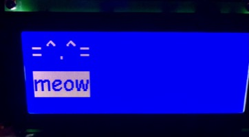
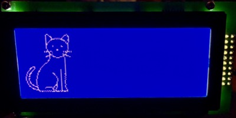
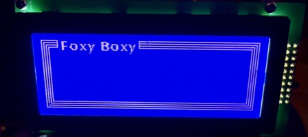
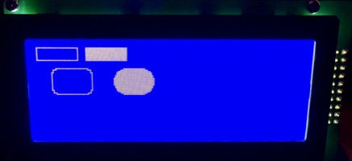
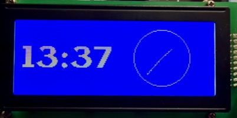
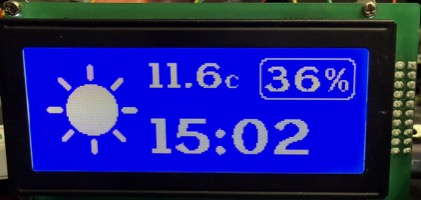
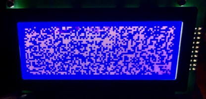
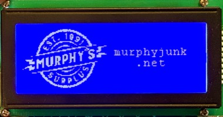

<!-- TOC -->
* [MicroPython Topway LM19264 LCD driver](#micropython-topway-lm19264-lcd-driver)
  * [Tested on](#tested-on)
  * [Display Features](#display-features)
  * [OMG WHERE DO I GET ONE?](#omg-where-do-i-get-one)
  * [Datasheets](#datasheets)
    * [Display](#display)
    * [Controllers](#controllers)
  * [Interface](#interface)
  * [Example Wiring](#example-wiring)
    * [Example Wiring for an ESP32 S2 Mini](#example-wiring-for-an-esp32-s2-mini)
  * [Fonts](#fonts)
  * [Example Code](#example-code)
    * [Bitmap Version](#bitmap-version)
      * [Basic & Inverted Text](#basic--inverted-text)
      * [Display graphics and logical "or"](#display-graphics-and-logical-or)
      * [Display text and draw lines with dynamic object spacing](#display-text-and-draw-lines-with-dynamic-object-spacing)
      * [Display boxes and inverted boxes](#display-boxes-and-inverted-boxes)
      * [Read data from the display](#read-data-from-the-display)
    * [ESP32-specific](#esp32-specific)
      * [ESP32 Wi-Fi NTP clock with clock face](#esp32-wi-fi-ntp-clock-with-clock-face)
      * [ESP32 Wi-Fi NTP clock with weather](#esp32-wi-fi-ntp-clock-with-weather)
    * [FrameBuffer version](#framebuffer-version)
      * [Display text and draw lines with dynamic object spacing](#display-text-and-draw-lines-with-dynamic-object-spacing-1)
      * [Display boxes and inverted boxes](#display-boxes-and-inverted-boxes-1)
      * [Display text and draw lines with dynamic object spacing](#display-text-and-draw-lines-with-dynamic-object-spacing-2)
* [Thank You <3](#thank-you-3)
<!-- TOC -->

# MicroPython Topway LM19264 LCD driver

This is a relatively quick driver I wrote for the Topway LM19264 192x64 LCD using the parallel interface based on datasheets for the LCD and the LCD controllers. 

The blue is just so freaking pretty! :')

This particular display contains three LCD controllers which have to be addressed individually, and it doesn't have a built-in font table, so creating bitmapped fonts was necessary. There is also no built-in frame buffer, so I have two available drivers that use a bitmapped array as well as one that uses the micropython `framebuf.FrameBuffer` frame buffer that is written in C.

Refresh rates for the display will be fairly slow due to the overhead of python versus this being written in C. The point is to be approachable and help inspire developers to replicate the logic in the language of their choice. :-)

If you like my work and would like to buy me a coffee, please consider donating to

| [Cash App](https://cash.app/$MuffintopBikini)      | [Venmo](https://venmo.com/u/MuffintopBikini)  |
|----------------------------------------------------|-----------------------------------------------|
|  |  |

## Tested on

* MicroPython:
  * Tested on MicroPython 1.25.0
  * Tested on MicroPython 1.26.0
  * Tested on MicroPython 1.26.1
  * Tested on MicroPython 1.27.0
  * Tested on MicroPython 1.27.1

* Hardware:
  * Tested on ESP32 S2 Mini

## Display Features

* 192x64 pixels
  * Using three 64x64 LCD controllers for left, middle, and right regions.
* Runs off 5v DC power.
* TTL (5v) logic levels. 
* Contrast adjustable via variable resistor.
* 8-bit parallel interface.

## OMG WHERE DO I GET ONE?

I got mine from the [Murphy's Surplus](https://murphyjunk.net) [eBay store](https://www.ebay.com/str/murphyjunk). I don't know how long this URL will be valid, but the specific item listing where I got mine from is: [https://www.ebay.com/itm/202783364646](https://www.ebay.com/itm/202783364646).

The supplemental board that comes with this is essentially what I'm doing here but in a much more proprietary way, so I scrapped it.

## Datasheets

### Display

* [LM19264AFW.pdf](_datasheets/LM19264AFW.pdf)

### Controllers

* [KS0108.pdf](_datasheets/KS0108.pdf)
* [S6B0107.pdf](_datasheets/S6B0107.pdf)

## Interface

<table>
<tr>
<td>Pin</td><td>Signal</td><td>Type</td><td>Description</td>
</tr><tr>
<td>1</td><td>DB7 (data)</td><td>I/O</td><td rowspan="8" align="left" valign="top">Data bus</td>
</tr><tr>
<td>2</td><td>DB6 (data)</td><td>I/O</td>
</tr><tr>
<td>3</td><td>DB5 (data)</td><td>I/O</td>
</tr><tr>
<td>4</td><td>DB4 (data)</td><td>I/O</td>
</tr><tr>
<td>5</td><td>DB3 (data)</td><td>I/O</td>
</tr><tr>
<td>6</td><td>DB2 (data)</td><td>I/O</td>
</tr><tr>
<td>7</td><td>DB1 (data)</td><td>I/O</td>
</tr><tr>
<td>8</td><td>DB0 (data)</td><td>I/O</td>
</tr><tr>
<td>9</td><td>E</td><td>input</td><td rowspan="2" align="left" valign="top"><b>In read mode</b>:<br>R/W: H<br>CSB/CSA: (select chip)<br>E = H, data will be available DB0-DB7 for that chip<br>(set E = L then select a new chip CSA/CSB, set E = H again to read data for that chip)<br><br><b>In write mode</b>:<br>R/W = L<br>CSB/CSA: (select chip)<br>Set data at DB0-DB7<br>E = H, data will be read<br>(set E = L then select a new chip CSA/CSB, write new data to DB0-DB7, set E = H again to read data for that chip)</td>
</tr><tr>
<td>10</td><td>RW (read/write)</td><td>input</td>
</tr><tr>
<td>11</td><td>RS (command/data)</td><td>input</td><td>RS = H; display data<br>RS = L; instruction data</td>
</tr><tr> 
<td>12</td><td>V0 LCD contrast</td><td>power</td><td>LCD contrast reference voltage (wiper of the variable resistor)</td>
</tr><tr>
<td>13</td><td>VDD (+5v DC)</td><td>power</td><td>Positive Power Supply</td>
</tr><tr>
<td>14</td><td>VSS (ground)</td><td>power</td><td>Negative Power Supply, Ground (0V)</td>
</tr><tr>
<td>15</td><td>CSA (chip select)</td><td>input</td><td rowspan="2" align="left" valign="top">Chip selection for each region of the LCD<br>CSB = L, CSA = L, left side<br>CSB = L, CSA = H, middle<br>CSB = H, CSA = L, right side</td>
</tr><tr>
<td>16</td><td>CSB (chip select)</td><td>input</td>
</tr><tr>
<td>17</td><td>VOUT</td><td>output</td><td>Voltage out for backlight control through variable resistor.</td>
</tr><tr>
<td>18</td><td>RTSB (reset)</td><td>input</td><td>Active low</td>
</tr><tr>
<td>19</td><td>BLA (backlight + DC)</td><td>power</td><td>Backlight positive</td>
</tr><tr>
<td>20</td><td>BLK (backlight - DC)</td><td>power</td><td>Backlight negative</td>
</tr>
</table>

* For LCD contrast, use a 3-leg variable resistor 25k ohm to 50k ohm. One leg connects to VOUT, the middle/wiper connects to V0 (LCD contrast), the other leg connects to VDD (+5v DC).

## Example Wiring

### Example Wiring for an ESP32 S2 Mini

Because this LCD needs TTL (5v) logic levels, I used two 8-channel 3.3v/5v bi-directional level shifters. 

| LCD pin | Level Shifter | ESP32 GPIO | Power                                            |
|---------|---------------|------------|--------------------------------------------------|
| 1       | A 1           | Pin 1      |                                                  |
| 2       | A 2           | Pin 2      |                                                  |
| 3       | A 3           | Pin 3      |                                                  |
| 4       | A 4           | Pin 4      |                                                  |
| 5       | A 5           | Pin 5      |                                                  |
| 6       | A 6           | Pin 6      |                                                  |
| 7       | A 7           | Pin 7      |                                                  |
| 8       | A 8           | Pin 8      |                                                  |
| 9       | B 1           | Pin 9      |                                                  |
| 10      | B 2           | Pin 10     |                                                  |
| 11      | B 3           | Pin 11     |                                                  |
| 12      |               |            | (wiper of variable resistor)                     |
| 13      |               |            | VBUS +5v (also to side leg of variable resistor) |
| 14      |               |            | GND                                              |
| 15      | B 4           | Pin 13     |                                                  |
| 16      | B 5           | Pin 12     |                                                  |
| 17      |               |            | (side leg of variable resistor                   |
| 18      | B 6           | Pin 14     |                                                  |
| 19      |               |            | VBUS +5v (full brightness)                       |
| 20      |               |            | GND                                              |

## Fonts

Because this LCD doesn't have a built-in font table, the `font_to_py` Python libary was used to generate the font files used by this driver and placed in the `topway/fonts` directory. Also in the `topway/fonts` directory is a `script.build_fonts.sh` script that I used to generate the font files including the `extended` character map.

To use font sizes, you need to generate a font file for the font and specific size you want to use, example:
```bash
$ font_to_py -y -k extended /System/Library/Fonts/Supplemental/Courier\ New.ttf 12 CourierNew_size12.py
$ font_to_py -y -k extended /System/Library/Fonts/Supplemental/Courier\ New.ttf 24 CourierNew_size24.py
$ font_to_py -y -k extended /System/Library/Fonts/Supplemental/Courier\ New.ttf 36 CourierNew_size36.py
```

And then in your micropython code, you can import the font file like:
```python
from topway.font import CourierNew_size12
```
(these fonts are located in the `topway/fonts` directory)

And use them to modify the bitmap array like:
```python
bitmap = lcd.draw_text(bitmap=bitmap, text="WAITING", x=95, y=15, font_map=CourierNew_size12)
bitmap = lcd.draw_text(bitmap=bitmap, text="FOR WIFI", x=95, y=35, font_map=CourierNew_size12)
```

## Example Code

I tried to document the code as much as possible while including some key details from the datasheets. 

**NOTE**: You may have to change the pin configuration match your hardware. 

Most of the methods are the same as my [MicroPython_Futaba_NAGP1250](https://github.com/AlmightyOatmeal/MicroPython_Futaba_NAGP1250) functions with some exceptions like scrolling, font zooming, user-defined windows, which are part of that display's controller. Changing fonts is set by defining the font(s) you would like to use and pass them into the appropriate method. As much backward compatability was maintained in the bitmap version, which means adding graphics, icons, etc., will remain the same, but that does change when using the FrameBuffer version.

The API has been kept as close as possible between the bitmap array and the FrameBuffer versions of this driver for backward compatability.

**Please refer to [MicroPython_Futaba_NAGP1250](https://github.com/AlmightyOatmeal/MicroPython_Futaba_NAGP1250) for more examples.**

### Bitmap Version

#### Basic & Inverted Text

```python
from topway import LM19264
from topway.font import ComicSansMS_size24 as font

lcd = LM19264(
    db0=8, db1=7, db2=6, db3=5, db4=4, db5=3, db6=2, db7=1,
    e=9, rw=10, rs=11, csa=13, csb=12, rstb=14
)

lcd.initialize()

width = 192
height = 64
bitmap = [[0 for _ in range(width)] for _ in range(height)]

# Regular Text
bitmap = lcd.draw_text(bitmap=bitmap, text="=^.^=", x=0, y=0, font_map=font)
# Inverted Text
bitmap = lcd.draw_text(bitmap=bitmap, text="meow", x=0, y=30, font_map=font, invert=True, spacing=0)

packed = lcd.pack_bitmap(bitmap=bitmap)
lcd.display_bitmap(bitmap=packed)
```



#### Display graphics and logical "or"

**CODE**: [EXAMPLES/Cat.py](EXAMPLES/Cat.py)



#### Display text and draw lines with dynamic object spacing

**CODE**: [EXAMPLES/Fancy_Box.py](EXAMPLES/Fancy_Box.py)



#### Display boxes and inverted boxes

**CODE**: [EXAMPLES/graphic_boxes.py](EXAMPLES/graphic_boxes.py)



#### Read data from the display

This is still a work in progress and susceptible to crosstalk interference on the data lines, so if the returned bitmap has unusual pixels, it's interference.

```python
from topway import LM19264


lcd = LM19264(
    db0=8, db1=7, db2=6, db3=5, db4=4, db5=3, db6=2, db7=1,  # DB7–DB0
    e=9, rw=10, rs=11, csa=13, csb=12, rstb=14
)

lcd.initialize()

bitmap = lcd.read_display_to_bitmap()
```

If you would like to save the bitmap to a png file so that it mimics the display, you can use this python code to take a bitmap array and save it as a png file:

```python
from PIL import Image


def save_bitmap_to_png(bitmap, filename="lcd_dump.png", scale=4,
                       foreground=(255, 255, 255), background=(0, 0, 100)):
    """
    Save a 2D bitmap to a PNG image with custom RGB foreground/background colors.
    """
    height = len(bitmap)
    width = len(bitmap[0])

    img = Image.new("RGB", (width, height))

    pixels = [foreground if pixel else background for row in bitmap for pixel in row]
    img.putdata(pixels)

    if scale > 1:
        img = img.resize((width * scale, height * scale), Image.NEAREST)

    img.save(filename)
    print(f"Saved bitmap to {filename}")


bitmap = [ ...bitmap array... ]

save_bitmap_to_png(bitmap, "lcd_blue.png", scale=4, foreground=(255, 255, 255), background=(0, 0, 255))
```

**NOTE**: This is a Python script that uses the PIL (Python Imaging Library) library to save the bitmap to a PNG file.

### ESP32-specific

#### ESP32 Wi-Fi NTP clock with clock face

**CODE**: [EXAMPLES/esp32_wifi_clock_clockface.py](EXAMPLES/esp32_wifi_clock_clockface.py)



#### ESP32 Wi-Fi NTP clock with weather

**CODE**: [EXAMPLES/esp32_wifi_weather.py](EXAMPLES/esp32_wifi_weather.py)



### FrameBuffer version

There is a noticeable performance difference here, but its true potential can be released in a lower level language like C which eliminates a lot of python overhead.

#### Display text and draw lines with dynamic object spacing

**CODE**: [EXAMPLES/Fancy_Box_fb.py](EXAMPLES/Fancy_Box_fb.py)


#### Display boxes and inverted boxes

**CODE**: [EXAMPLES/graphic_boxes_fb.py](EXAMPLES/graphic_boxes_fb.py)


#### Display text and draw lines with dynamic object spacing

**CODE**: [EXAMPLES/Static_fb.py](EXAMPLES/Static_fb.py)



# Thank You <3

A special thanks to [Murphy's Surplus](https://murphyjunk.net) for providing these beautiful displays at an incredible price and for having next level customer service!




